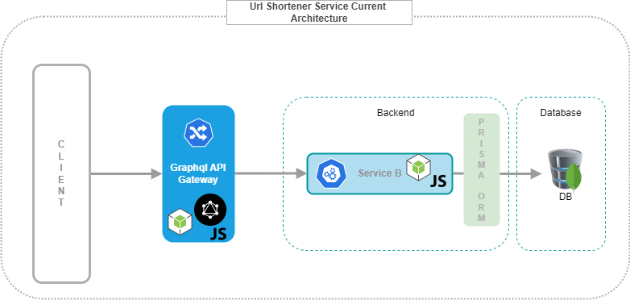
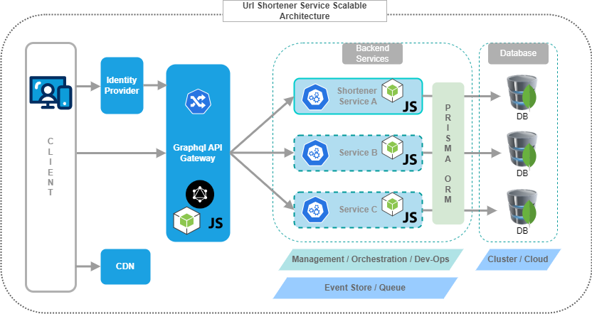

<div align="center">

  <h1>Url Shortener Gateway</h1>
  
  <p>
    GraphQL Node Express Typescript Tech Stack

    The service will work as a proxy service or a gateway service before the Url Shortener backend service.
  </p>
  
  
</div>

<br />

<!-- Table of Contents -->
# Table of Contents

- [About the Project](#about-the-project)
  * [Tech Stack](#tech-stack)
  * [Features](#features)
  * [Logging](#logging)
- [Getting Started](#getting-started)
  * [Prerequisites](#prerequisites)
  * [Installation](#installation)
  * [Code Quality Check](#code-quality-check)
  * [Running Tests](#running-tests)
  * [Build Application](#build-application)
  * [Run Application](#run-application)
  * [Run with Docker](#run-with-docker)
  * [Access Graphql Playground](#accessgraphqlplayground)    
  * [Service API Endpoints](#service-api-endpoints)  
- [System Architecture](#system-architecture)
  * [Project Structure](#project-structure)
  * [Current System Architecture](#current-system-architecture)
  * [Scalable System Architecture](#scalable-system-architecture)
  

  

<!-- About the Project -->
## About the Project

<!-- TechStack -->
### Tech Stack

- ***GraphQl***
- ***Node.js***
- ***Express.js***
- ***Typescript***
- ***npm***


<!-- Features -->
### Features

- ***Package managament*** -- npm
- ***Testing*** -- Jest and Supertest
- ***Cross-Origin Resource-Sharing*** -- using cors
- ***Logging*** -- winston
- ***Code quality*** -- Eslint
- ***Code style and formatting*** -- Prettier
- ***Containerization*** -- Docker


<!-- Logging -->
### Logging
Below logs are generated under `logs` directory
1. `server.log`
2. `error.log`
3. `exceptions.log`


<!-- Getting Started -->
## Getting Started

<!-- Prerequisites -->
### Prerequisites

This project uses Node.js as runtime environment.

This project uses npm as package manager. to check the latest version of npm use below command

```bash
 npm install -g npm
```

<!-- Installation -->
### Installation

```bash
  git clone <repo>
```

Go to the project directory

```bash
  cd <repo name>
```

```bash
  npm install
```


<!-- Code Quality Check -->
### Code Quality Check

#### Linting

```bash
  # run ESLint
  npm run lint
  
  # fix ESLint errors
  npm run lint:fix
```

#### Prettier
```bash
  # run prettier
  npm code-check

  # fix prettier errors
  npm run code-format
    
```
   
<!-- Running Tests -->
### Running Tests

To run tests, run the following command

```bash
  npm run test
```

<!-- Build Application -->
### Build Application

Build the application

```bash
  npm run build
```


<!-- Run Application -->
### Run Application

Start the server in development mode

```bash
  npm run dev
```

Start the server in production mode

```bash
  npm start
```

<!-- Run with Docker -->
### Run with Docker

Build the container

```bash
  docker build . -t url-shortener-gateway     
```

Start the container

```bash
  docker run -p <port>:4001 -d url-shortener-gateway    
```

<!-- Access Graphql Playground -->
### Access Graphql Playground
-Access Graphql Playground to run queries

-Run below url in browser
`http://localhost:4001`


<!-- Service API Endpoints -->
### Service API Endpoints

1. Retrieve Data by Shortened Url: 
    - Query:
  ```bash
      query {
        getDataByShortenedUrl(shortenedUrl: "<shortened url>") {
          longUrl
          shortenedUrl
        }
      }
  ```

2. Create Shortened Url record:
    - Query: 
  ```bash
    query {
      createRecord(longUrl: "<specific long url>") {
        longUrl
        shortenedUrl
      }
    }
  ```


3. Retrieve first Record :
    - Query:
  ```bash
      query {
        getAllUrls {
          longUrl
          shortenedUrl       
        }
      }
  ```

<!-- System Architecture -->
## System Architecture

<!-- Project Structure -->
### Project Structure

```bash
__test__/
┗ server.test.ts
dist/
logs/
src/
┣ config/
┃ ┗ config.ts
┣ Middleware/
┃ ┣ connection.handler.ts
┃ ┗ logger.ts
┣ Schema/
┃ ┣ Mutations/
┃ ┣ Queries/
┃ ┃ ┗ UrlQueries.ts
┃ ┣ TypeDefs/
┃ ┃ ┗ Urls.ts
┃ ┗ index.ts
┣ env.d.ts
┗ server.ts
```

<!-- Current System Architecture -->
### Current System Architecture




<!-- Scalable System Architecture -->
### Scalable System Architecture

